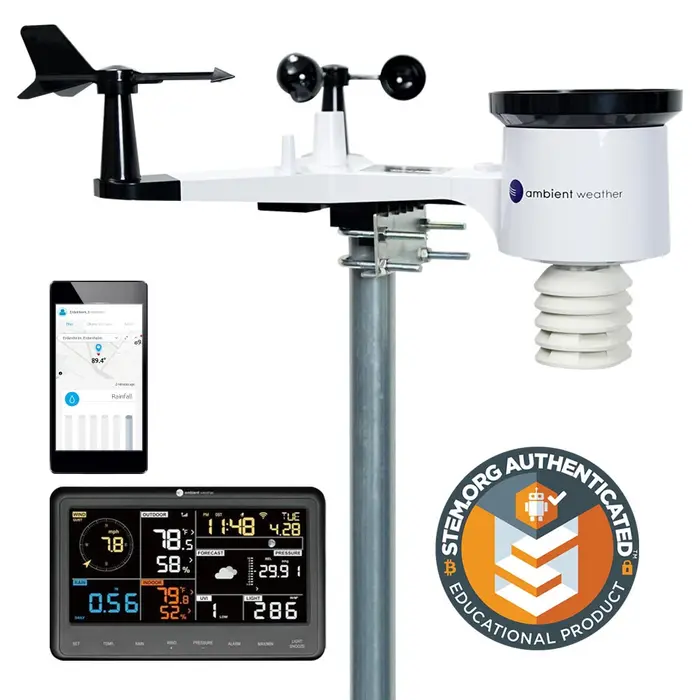
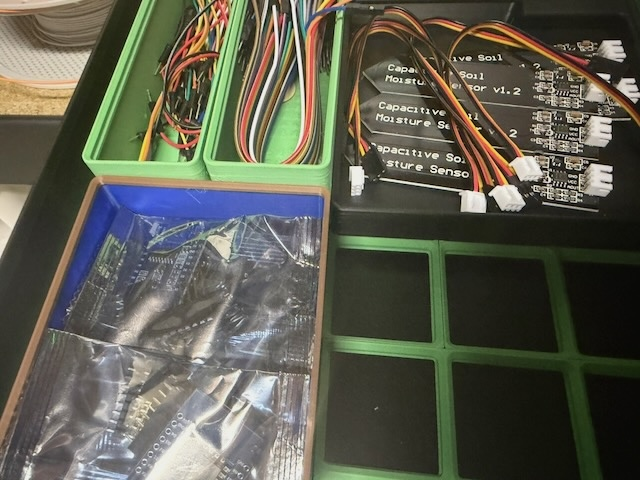
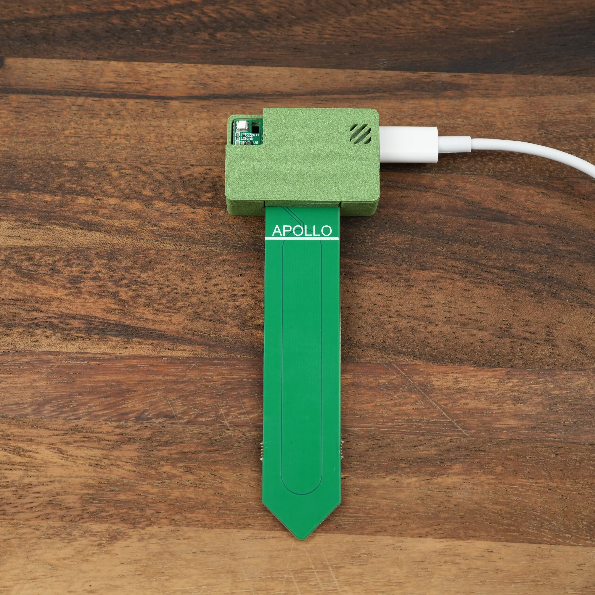
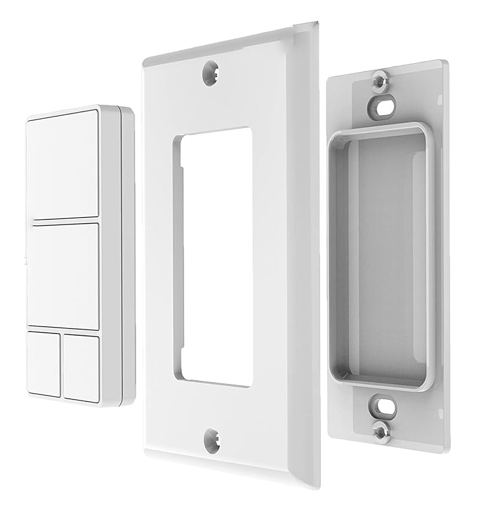
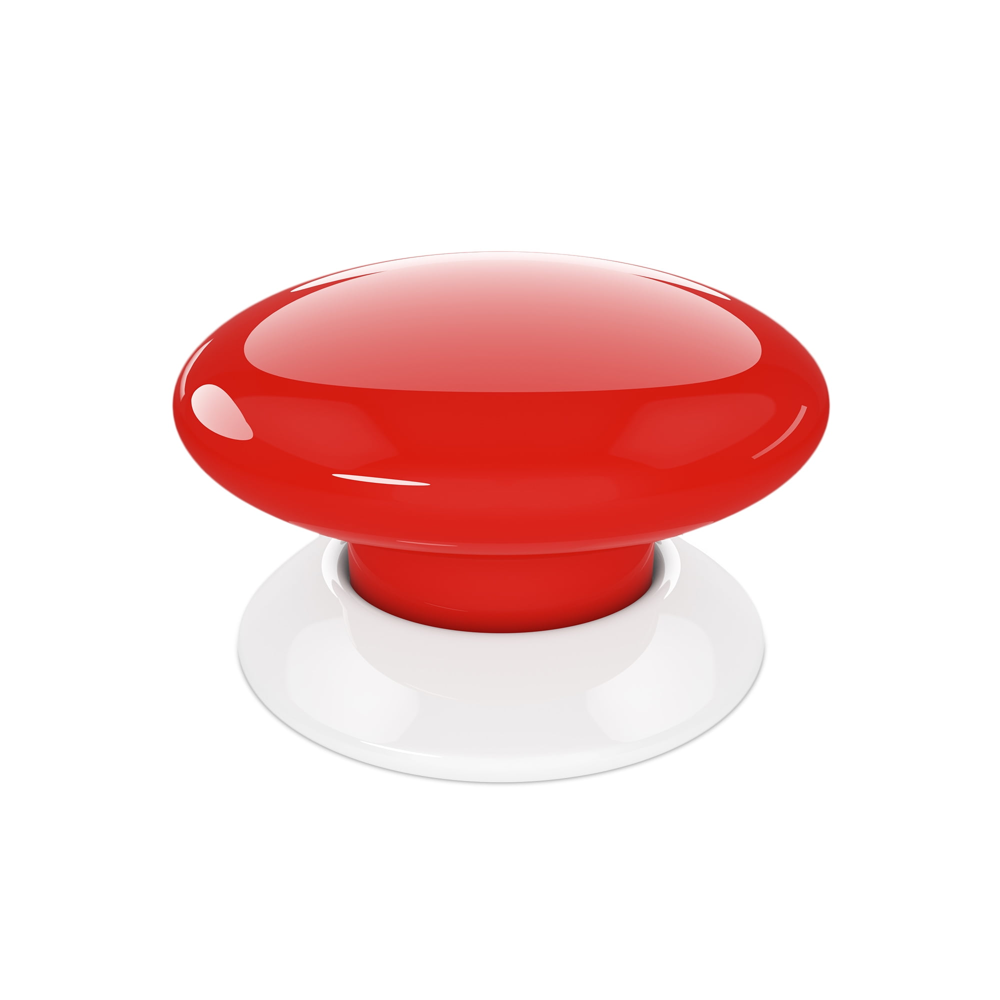
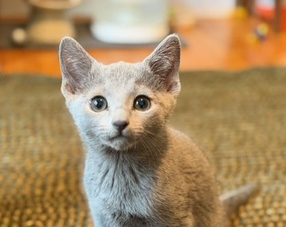
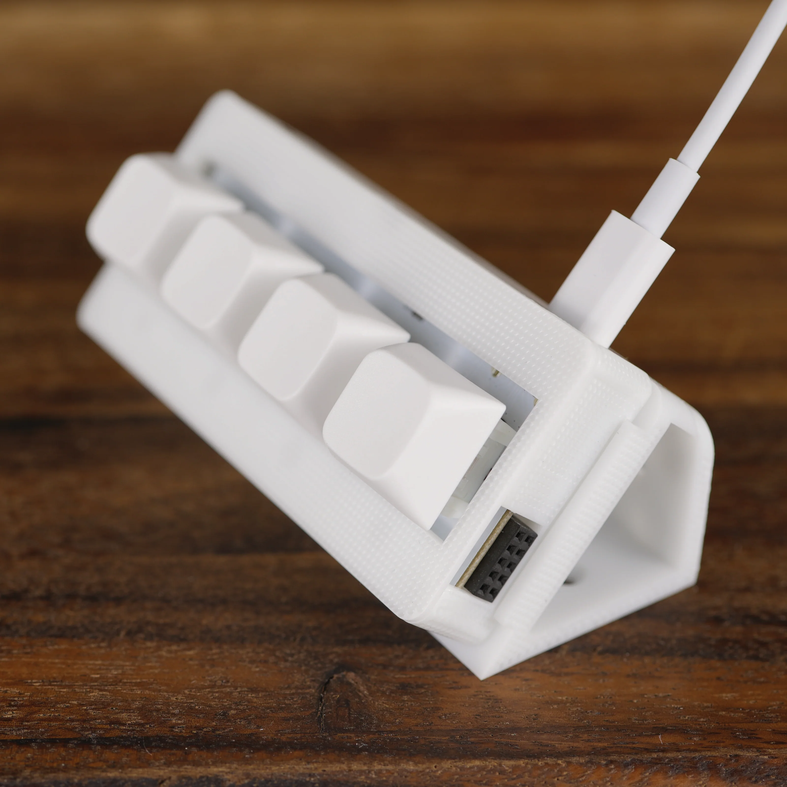

# [fit] A Weather Station,
# [fit] Plant Monitors,
# [fit] Buttons,
# [fit] and Other Smart Home Fun

---

# This Presentation in on GitHub

## You can find me if you remember how to spell my name "Jachin"

### Not a lot of Jachins on the Internet

---

# Amateur
## Former Full Time Software Engineer

- A long time ago I was a full stack web developer
- Long and slow migration to web frontend
- Long and slow migration to functional programming and strongly typed languages
- Mostly a stay-at-home Dad now
- Less time in front of my computer
- More variety of technology projects

---

# [fit] A Little bit about "self hosting" and "local first"

- "local first" means "it still works with no Internet"
- "self hosting" means "it is in my house"
- Running locally is a priority for me
- You need to run some infrastructure in your home
- Self hosting is fun
- I lean heavily on TrueNAS Scale
- Talk more later

---

# [fit] 🌦️📺
# [fit] Weather Station


---

> Why would I want my own weather station?
-- Just about everyone with a smart phone

---

## The actual weather

 - Sometimes the weather at your house is different than the weather at the closest weather station
 - Growing Degree Days

## Contributing to weather data

## Fun

---

# [fit] Ambient Weather WS-2902D Web G



---

# How it works

- Weather station collects weather data
- Send data to the indoor station every minute
- Indoor station displays it
- Optionally sends it to a "Cloud" service
- No local storage (but I think some do)

^ The base station tries to send your weather data to the cloud (where you can use their app)
^ But you're not exactly locked in. You can point the base station at any URL, but it has to mimic the API of either AmbientWeather or Wunderground. Which, as these things go, is fine, just _fine_.
^ If the data isn't collected, it's gone

---

# Weather Station Data Collector

## Easy to build

 - Behold the power of LLMs
 - Re implement an existing API (no problem)

## Extra polish

 - Wrap it all up in a Docker image
 - APIs for getting the weather data out

---

# To my TRMNL

## I talked last year about TRMNL

## Built a plugin

^ There should be a picture here but I didn't get to it

---

# Windmill


> Code-first orchestration platform for internal software

---

# Windmill

- Fancy Cron
- "Update my TRMNL plugin with the latest weather from my weather station every 15 minutes"
- Easy to install (and update) on TrueNAS
- Way more than I need (but thoughtfully designed so it's not hard to use)
- Lots of other things out there to do this

---

# The Whole Solution

```pikchr
WS: box rad 10px "🌦️ Weather Station" fit
arrow right 200% "AmbientWeather HTTP API" above
DC: box rad 10px "📡 Weather Station" "Data Collector" fit
arrow down 200% "HTTP API" aligned above
WM: box rad 10px "🔄 Windmill" fit
arrow left 500% "Web Hooks with JSON Payloads" above
TP: box rad 10px "🖥️ TRMNL Plugin" fit
```

---

# Weather Station TODOs

- Weather Station data collector
  - Not quite reliable enough
  - Better APIs
  - Data Roll up
- TRMNL
  - Self Host TRMNL Software
  - Better looking plugin

---

# [fit] 🌱👀
# [fit] Plant Monitors

---

### I intend to make my own
## someday



---


# Apollo Automation

- Very open
- ESP32 for everything (maybe?)
- A little pricey

^ 3D printed cases
^ Functional
^ It's the kind of thing you could build your self, so it's easy to decide if you'd rather just buy what they've made
^ Wifi (not a lower power)

---



# PLT-1

- A plant monitor you don't have to build your self
- ESPHome
- Super easy to setup
- I like the power options (rechargeable battery or plugin)
- The hard part is figuring out how make the data useful
- Knowing what the soil moisture is ≠ knowing when to water your plants

---

# PLT-1

- Not quite sure what to do with the data yet
- How much water does a particular plant even need?

^ My wife mostly takes care of the plants
^ She's always "saying" her plants our dying but they hardly ever do

---

# [fit] 🔘🔲
# [fit] Buttons

---

# Minoston 800 Series ZWave



^ This is a popular form factor. A company called Zooz also makes something very similar. They have a rechargeable version you can charge with USB-C
^ I bought one of each of my kid's rooms.
^ They worked a lot better once I moved the hub to the middle of the house.
^ Mesh-Smesh

---

# Bed Time

## 1 Button cycles through 4 scenes

```pikchr
boxwid = 2
boxht = 1

# Top
G: box rad 0.25 \
  "Getting ready for bed" \
  "White noise: ON" \
  "LED strip: ON" \
  "Book lamp: ON" \
  at 0,1.5

# Right
W: box rad 0.25 \
  "Winding Down" \
  "White noise: ON" \
  "LED strip: DIM" \
  "Book lamp: ON" \
  at 2,0

# Bottom
S: box rad 0.25 \
  "Sleeping" \
  "White noise: OFF" \
  "LED strip: VERY DIM" \
  "Book lamp: OFF" \
  at 0,-1.5

# Left
U: box rad 0.25 \
  "Wake up (Everything off)" \
  "White noise: OFF" \
  "LED strip: OFF" \
  "Book lamp: OFF" \
  at -2,0

# Arrows (cycle clockwise)
arrow from G.e to W.n thick thick thick
arrow from W.s to S.e thick thick thick
arrow from S.w to U.s thick thick thick
arrow from U.n to G.w thick thick thick
```

---

# Too may buttons

- Paradigm shift to think in "scenes"
- Everything does not need it's own button

---




# [fit] Birthday Button

---

# Build your own Birthday Button

- Hubitat has a cool voice notification feature
- Snooty British Voice
- Leverage (1, 2, 3, clicks)
- Silly Poems

^ The big button has nice drama, but it stopped working
^ Time based rules
^ Excited to use the Apollo keyboard button, maybe do something with the lights

---

# LLM Generated Poems

- Silly Birthday Themed Poems
- Personalized
- Suggest the style of poem (limerick, sonnet, etc)
- Is it great poetry? 👎
- Is it better than I can do? 👍
- Is it fun? 👍

---



# [fit] Time to feed the Cat

---



# [fit] BTN-1

 - Apollo Automation
 - 4 Buttons
 - 4 LEDs
 - Customizable

^ Standard Keyboard Switches
^ You can put on your own key caps
^ Use your own switches

---

# Remember to feed the cat
## Schedule and Notifications

- Hubitat makes this easy-ish
- Turn on lights when it's time to feed the cat
- One color for each kid (when it's their turn to feed the cat)
- Push the button when you're done
- The Light turns off
- Still figuring out the battery situation

^ I probably need to find a place to put it where it can stay plugged in
^ The magnets work good for keeping it on the fridge

---

# Thank You

## Questions and Discussion

### More?

---

# [fit] Garage Door Opener

---

# [fit] Door Bell

---

# [fit] Laundry Notifications

---

# [fit] Sprinkler System